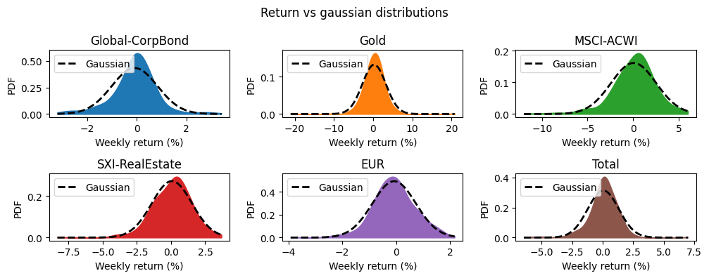
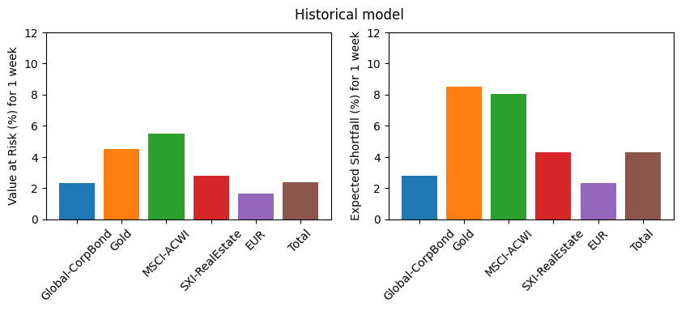
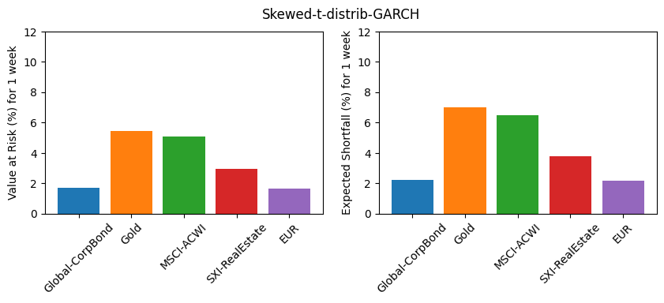
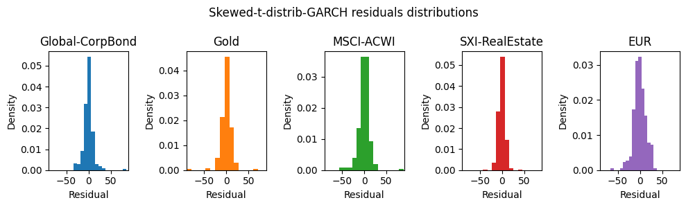
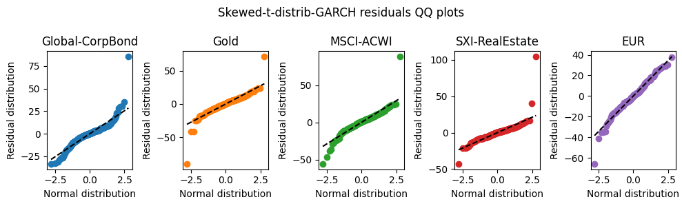
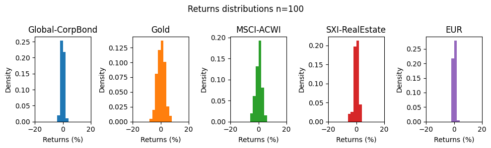
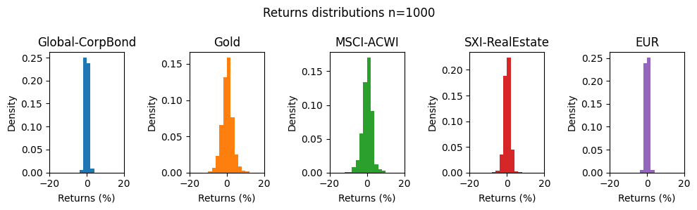
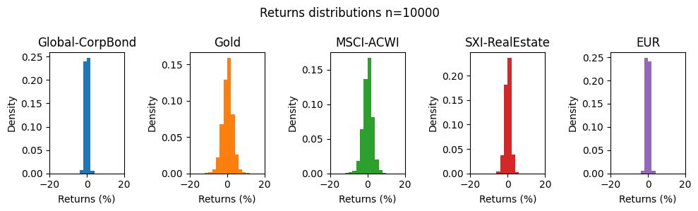
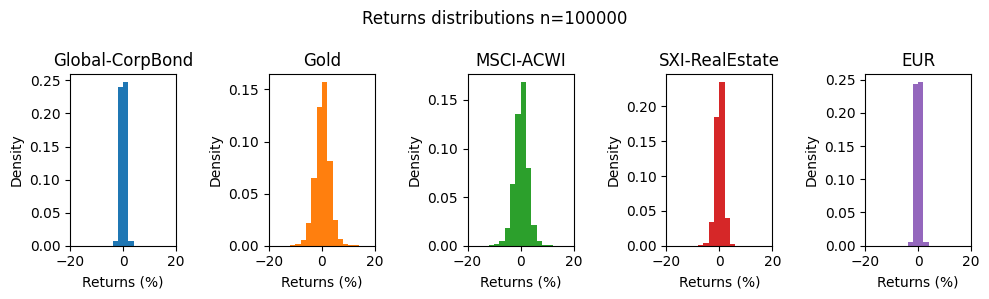
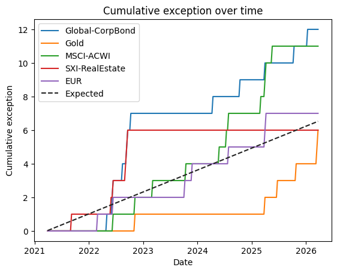

# Value at Risk (VaR) and Expected Shortfall (ES) Estimation for a Multi-Asset Portfolio

## Overview
This project develops and validates a market risk engine for estimating 1-week Value at Risk (VaR) and Expected Shortfall (ES) for a diversified multi-asset portfolio.

The framework benchmarks historical simulation, parametric approaches, and Monte Carlo simulation under increasingly realistic assumptions. In particular, it evaluates constant-volatility and time-varying volatility specifications, as well as Gaussian, Student-t, and skewed-t innovation distributions.

The analysis is designed as a model selection exercise rather than a single-model implementation. Each specification is assessed using distribution diagnostics, heteroskedasticity tests, dependence diagnostics, convergence analysis, and VaR backtesting. Over the sample considered, CCC-GARCH(1,1) with skewed-t innovations provides the most credible tail-risk estimates and the strongest validation results.

## Main findings
- Return distributions are non-Gaussian, asymmetric, and heavy-tailed.
- Volatility is time-varying, making constant-volatility models inadequate.
- Heavy-tailed and asymmetric innovations materially improve risk measurement.
- The skewed-t CCC-GARCH specification performs best in backtesting.
- Portfolio tail risk is more sensitive to volatility stress than to correlation stress.


# 1.i Table of content
1. Overview
    1. Table of content
2. Key features
3. Data and Protfolio
    1. Data sources
        1. ETFs
        2. Currency Rates
    2. Portfolio composition
4. Methodology
    1. Risk measures
    2. Model comparison
    3. Parametric and simulation specifications
    4. Model selection logic
    5. Key assumptions and limitations
    6. Portfolio
5. Technologies used
6. How to run the project
7. Results
    1. Distributions
    2. VaR and ES
8. Validation and testing
    1. Distribution diagnostics
    2. Monte Carlo convergence
    3. Backtesting
    4. Benchmarking
    5. Stress testing
        1. Stress multiplier
        2. Tail risk ratio
    6. Model selection summary
9. Model limitations
10. Background and motivation
11. Project structure
12. Future improvements

# 2. Key features
- Multi-method VaR/ES framework: historical, parametric, and Monte Carlo
- Dynamic volatility modeling via CCC-GARCH(1,1)
- Alternative innovation distributions: Gaussian, Student-t, and skewed-t
- Cross-asset dependence modeling through conditional correlation and Cholesky decomposition
- Model validation through normality diagnostics, heteroskedasticity testing, dependence testing, and residual analysis
- VaR backtesting using Kupiec and Christoffersen-style coverage checks
- Monte Carlo convergence analysis for tail quantile stability
- Stress testing of volatility and dependence assumptions
- Modular Python implementation for reproducibility and extension

# 3. Data and Protfolio
## 3.i Data sources
Weekly data were collected over a 5‑year period.
### 3.i.a ETFs
| Provider | Fund Name | ISIN | Currency | Dividend Type | Last Data Point |
|----------|-----------|------|----------|---------------|-----------------|
| IShare | MSCI ACWI | IE00B6R52259 | USD | Acc | 23.03.2026 |
| UBS | SXI Real Estate | CH0124758522 | CHF | Dis | 23.03.2026 |
| UBS | Gold | CH0106027193 | USD | Dis | 23.03.2026 |
| IShare | Global Corp Bond | IE00B988C465 | CHF | Dis | 23.03.2026 |

### 3.i.b Currency Rates
| Pair | Last Data Point |
|------|-----------------|
| USD/CHF | 23.03.2026 |
| EUR/CHF | 23.03.2026 |

## 3.ii Portfolio Composition
- The portfolio was designed to provide broad geographic exposure and include multiple asset classes (equities, bonds, gold, real estate, FX).
- The portfolio allocation is provided in `Portfolio.txt`.

# 4. Methodology
### 4.i Risk measures
- VaR is defined as the negative 2.5th percentile of the 1-week profit-and-loss distribution.
- ES is defined as the conditional mean loss beyond the VaR threshold.

### 4.ii Model comparison
The analysis compares three classes of risk models:
- Historical simulation
- Parametric models
- Monte Carlo simulation

### 4.iii Parametric and simulation specifications
The following specifications are evaluated:
- Historical simulation
- Gaussian parametric model
- Exponentially weighted moving average (EWMA)
- Geometric Brownian motion with historical volatility
- CCC-GARCH(1,1) with Gaussian innovations
- CCC-GARCH(1,1) with Student-t innovations
- CCC-GARCH(1,1) with skewed-t innovations

### 4.iv Model selection logic
The models are assessed sequentially using:
- distribution diagnostics,
- heteroskedasticity tests,
- dependence diagnostics,
- convergence analysis,
- and VaR backtesting.
The final model is selected on the basis of empirical adequacy rather than model complexity alone. In this dataset, CCC-GARCH(1,1) with skewed-t innovations delivered the most credible tail-risk estimates and the strongest overall backtesting performance.

### 4.v Key assumptions and limitations
- Volatility is time-varying and modeled dynamically.
- Cross-asset dependence is captured through a constant conditional correlation (CCC) structure.
- Innovation distributions may be non-Gaussian, heavy-tailed, and asymmetric.
- Results are conditional on the selected sample period and portfolio composition; they should be interpreted as model-based estimates rather than exact forecasts.

# 5. Technologies used
- Python (NumPy, SciPy, Pandas)
- Matplotlib
- Jupyter Notebook

# 6. How to run the project
1. **Create a python virtual environment**
2. **Install dependencies**
    Run: `pip install -r Requirements.txt`
3. **Add your data files to the `Data` folder**  
    File name format: `Name_Currency_Dividend_Type.dat`  
    - **Name** — Identifier of the asset being tracked  
    - **Currency** — 3‑letter ISO currency code  
    - **Dividend** — `Dis` (Distribution) or `Acc` (Accumulation)  
    - **Type** — `Close` (closing price), `Div` (dividend), or `Cur` (currency rate)  
    - For currency pairs, use the format **Foreign-Local** (e.g., `USD-CHF`)  
    - Exchange rates must be expressed as **Foreign / Local**
    Each data file must contain two columns:
    - The first column is the date in `DD‑MM‑YYYY` format.
    - The second column is the corresponding value.
    - The first row must contain the headers: `Date` and `Value`.
    - Columns must be separated by two spaces.
4. **Set portfolio allocations**  
    Edit the file: `Portfolio.txt`
    - The first column is the **Name** in the same format as the **file name**.
    - The second column is the corresponding value.
    - The data files must not contain any header row.
    - Columns must be separated by two spaces.
5. **Run the main notebook**  
    Open and execute: `Main.ipynb`

# 7. Results
## 7.i Distributions

Returns are not gaussian distributed for all assets. They also show some asymmetry and large tail. This explain why skewed-t distribution, which provide both the tailing of student-t distribution and asymetry, supports the adequacy of the specification.

## 7.ii VaR and ES


The gap between historical and Monte Carlo estimates suggests that a volatility-sensitive model places more weight on recent market conditions than a long-window historical estimator. This is consistent with the idea that historical simulation can dilute current risk when calm and stressed regimes are pooled together.

# 8. Validation and testing
### 8.i Distribution diagnostics


Residual diagnostics indicate that the GARCH-based specifications materially improve the fit relative to simpler models. In particular, allowing for heavy tails and asymmetry produces residual behavior that is more consistent with the empirical return distribution.

### 8.ii Monte Carlo convergence




Monte Carlo convergence was assessed by comparing simulated return distributions and VaR estimates across increasing numbers of simulation paths (10^2, 10^3, 10^4, and 10^5). As the number of simulations increases, both the shape of the distribution and tail quantiles stabilize, indicating diminishing Monte Carlo error.
Although convergence appears satisfactory with approximately 1,000–10,000 simulations, 100,000 paths are retained in the final analysis to reduce estimation noise in extreme quantiles and improve the stability of ES estimates.

### 8.iii Backtesting

Backtesting shows that the selected skewed-t GARCH specification provides exception rates and exception dynamics that are consistent with the target confidence level. This supports the use of the model for portfolio-level tail-risk measurement over the sample considered.

## 8.iv Benchmarking


Again, there is a difference that might be explained by current economic situation.

## 8.v Stress testing
### 8.v.a Stress multiplier
| Scenario | Global-CorpBond | MSCI-ACWI | Gold | SXI-RealEstate | EUR |
|----------|-----------------|-----------|------|----------------|-----|
| Model | 1.0 | 1.0 | 1.0 | 1.0 | 1.0 |
| Correlation stress | 0.9 | 0.9 | 0.7 | 0.8 | 1.0 |
| Volatility stress | 2.6 | 3.0 | 3.3 | 2.7 | 2.6 |
| Volatility+Correlation stress | 2.6 | 3.1 | 3.4 | 2.5 | 3.5 |

Volatility stress produces a significantly higher VaR/ES multiplier than correlation stress. This indicates that the portfolio's tail risk is primarily driven by volatility shocks rather than by correlation breakdowns. 

### 8.v.b Tail risk ratio
| Scenario | Global-CorpBond | MSCI-ACWI | Gold | SXI-RealEstate | EUR |
|----------|-----------------|-----------|------|----------------|-----|
| Model | 1.3 | 1.3 | 1.3 | 1.3 | 1.3 |
| Correlation stress | 1.0 | 1.3 | 1.3 | 1.4 | 1.1 |
| Volatility stress | 1.5 | 1.8 | 1.3 | 1.2 | 1.2 |
| Volatility+Correlation stress | 1.4 | 1.2 | 1.2 | 1.3 | 1.2 |

The ES/VaR ratio remains relatively stable across stress scenarios, suggesting that stress primarily scales loss magnitude rather than materially altering tail shape. This is consistent with the linear nature of the portfolio, which does not contain strongly nonlinear payoffs such as options.

## 8.vi Model selection summary
The following table summarizes the risk models considered, their main assumptions, validation results, and the rationale for model acceptance or rejection.

| Model | Key assumptions | Diagnostics & backtesting | Assessment |
|-------|-----------------|---------------------------|------------|
| Historical simulation | Past distribution representative of future | Fails to adapt to current volatility regime | Benchmark only |
| Parametric Gaussian | Normal, i.i.d. returns | Rejected by normality tests | Inadequate |
| EWMA | Short-memory volatility dynamics | Residual non-normality remains | Partial improvement |
| GBM with constant volatility | Constant volatility, Gaussian shocks | Heteroskedasticity detected | Rejected |
| CCC-GARCH (Gaussian) | Time-varying volatility, normal innovations | Volatility modeled well but tails underestimated | Inadequate tail risk |
| CCC-GARCH (Student‑t) | Heavy-tailed innovations | Improved tail fit, mixed backtesting results | Acceptable |
| CCC-GARCH (Skewed‑t) | Heavy-tailed and asymmetric shocks | Best diagnostics and backtesting performance | **Selected model** |

Based on statistical diagnostics, backtesting results, and economic interpretability, CCC-GARCH(1,1) with skewed‑t innovations was selected as the final specification. This model provides the most credible representation of tail risk for the portfolio considered.

# 9. Model limitations
Several limitations should be kept in mind when interpreting the results of this analysis:
- **Constant conditional correlation:** Cross‑asset dependence is modeled using a CCC framework. While supported by diagnostics over the sample period, correlations may become time‑varying during periods of acute market stress.
- **Model‑based tail estimates:** VaR and ES are conditional on the chosen distributional assumptions. Misspecification of innovation distributions or volatility dynamics would directly affect tail‑risk estimates.
- **Sample dependence:** Parameter estimates and validation results depend on the selected historical window, which spans multiple market regimes. Different calibration periods may lead to different risk estimates.
- **Linear portfolio structure:** The portfolio does not include nonlinear instruments such as options. As a result, tail‑risk amplification due to convex payoffs is not captured.
These limitations reflect standard trade‑offs in tractable market risk modeling and highlight areas where more advanced or computationally intensive approaches could be explored.


# 10. Background and Motivation
This project studies the estimation of portfolio tail risk under realistic return dynamics. The focus is on how distributional asymmetry, heavy tails, time-varying volatility, and cross-asset dependence affect 1-week VaR and ES estimates.

Rather than relying on a single methodology, the analysis benchmarks historical simulation, parametric models, and Monte Carlo simulation under progressively richer assumptions. This makes it possible to identify which modeling choices materially improve risk measurement and which assumptions fail under diagnostic testing.


# 11. Project structure
```
VaR/
|-- Data/
|-- Figures/
|-- Source/
|   |-- Distribution.py
|   |-- MonteCarlo.py
|   |-- Plot.py
|   |-- StatTest.py
|   `-- Utils.py
|-- Main.ipynb
|-- Portfolio.txt
|-- README.txt
`-- Requirements.txt
```

# 12. Future improvements
- Use deep learning for volatility prediction
- Nonlinear instruments
- Dashboard