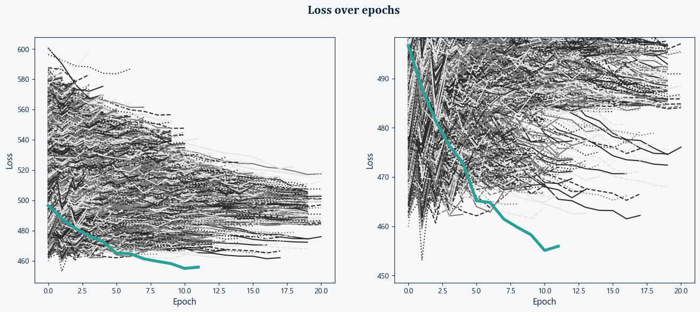
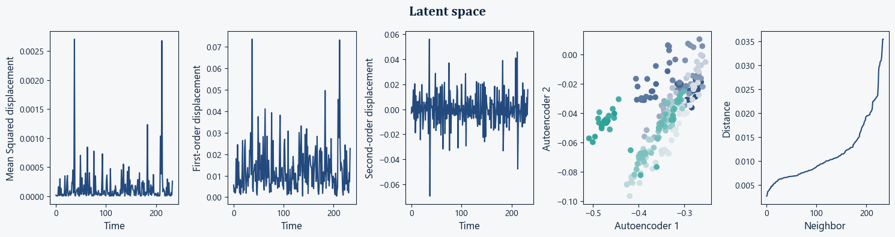
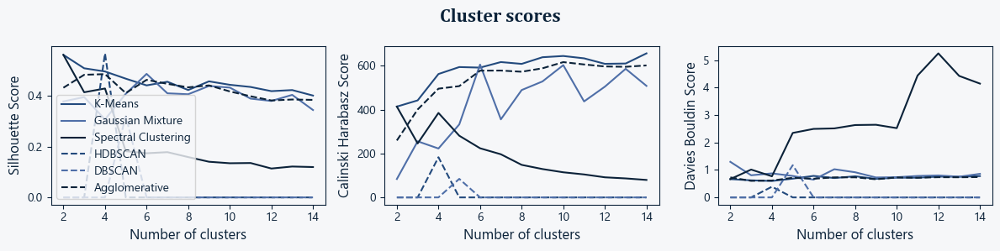
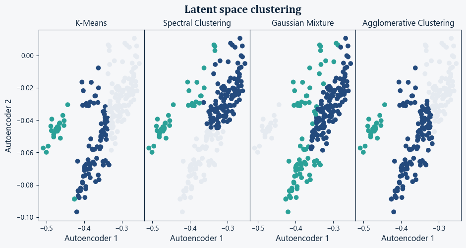
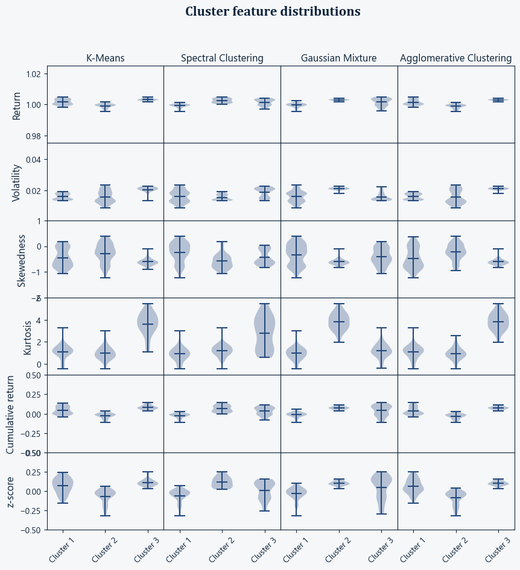

# Value at Risk (VaR) and Expected Shortfall (ES) Estimation for a Multi-Asset Portfolio

## Overview
This project develops and validates a market risk engine for estimating 1-week Value at Risk (VaR) and Expected Shortfall (ES) for a diversified multi-asset portfolio.

The framework benchmarks historical simulation, parametric approaches, and Monte Carlo simulation under increasingly realistic assumptions. In particular, it evaluates constant-volatility and time-varying volatility specifications, as well as Gaussian, Student-t, and skewed-t innovation distributions.

The analysis is designed as a model selection exercise rather than a single-model implementation. Each specification is assessed using distribution diagnostics, heteroskedasticity tests, dependence diagnostics, convergence analysis, and VaR backtesting. Over the sample considered, CCC-GARCH(1,1) with skewed-t innovations provides the most credible tail-risk estimates and the strongest validation results.

As an addon, a variational autoencoder was trained to compress rolling-window feature vectors into a lower-dimensional latent representation. The latent space was then used as an unsupervised representation of market regimes.

## Main findings
- Return distributions are non-Gaussian, asymmetric, and heavy-tailed.
- Volatility is time-varying, making constant-volatility models inadequate.
- Heavy-tailed and asymmetric innovations materially improve risk measurement.
- The skewed-t CCC-GARCH specification performs best in backtesting.
- Portfolio tail risk is more sensitive to volatility stress than to correlation stress.
- Deep representation learning can be used as a complementary tool for market-regime detection and stress monitoring.


# 1.i Table of content
1. Overview
    1. Table of content
2. Key features
3. Data and Protfolio
    1. Data sources
        1. ETFs
        2. Currency Rates
    2. Portfolio composition
4. Methodology
    1. Risk measures
    2. Model comparison
    3. Parametric and simulation specifications
    4. Model selection logic
    5. Key assumptions and limitations
    6. Portfolio
5. Technologies used
6. How to run the project
7. Results
    1. Distributions
    2. VaR and ES
8. Validation and testing
    1. Distribution diagnostics
    2. Monte Carlo convergence
    3. Backtesting
    4. Benchmarking
    5. Stress testing
        1. Stress multiplier
        2. Tail risk ratio
    6. Model selection summary
9. Model limitations
10. Stress-regime detection using deep learning
    1. Methodology
    2. Results
        1. Network optimization
        2. Latent-space analysis
    3. Conclusion
    4. Limitations
11. Background and motivation
12. Project structure
13. Future improvements

# 2. Key features
- Multi-method VaR/ES framework: historical, parametric, and Monte Carlo
- Dynamic volatility modeling via CCC-GARCH(1,1)
- Alternative innovation distributions: Gaussian, Student-t, and skewed-t
- Cross-asset dependence modeling through conditional correlation and Cholesky decomposition
- Model validation through normality diagnostics, heteroskedasticity testing, dependence testing, and residual analysis
- VaR backtesting using Kupiec and Christoffersen-style coverage checks
- Monte Carlo convergence analysis for tail quantile stability
- Stress testing of volatility and dependence assumptions
- Modular Python implementation for reproducibility and extension
- Variational Autoencoder for stress detection

# 3. Data and Protfolio
## 3.1 Data sources
Weekly data were collected over a 5‑year period.
### 3.1.1 ETFs
| Provider | Fund Name | ISIN | Currency | Dividend Type | Last Data Point |
|----------|-----------|------|----------|---------------|-----------------|
| IShare | MSCI ACWI | IE00B6R52259 | USD | Acc | 23.03.2026 |
| UBS | SXI Real Estate | CH0124758522 | CHF | Dis | 23.03.2026 |
| UBS | Gold | CH0106027193 | USD | Dis | 23.03.2026 |
| IShare | Global Corp Bond | IE00B988C465 | CHF | Dis | 23.03.2026 |

### 3.1.2 Currency Rates
| Pair | Last Data Point |
|------|-----------------|
| USD/CHF | 23.03.2026 |
| EUR/CHF | 23.03.2026 |

## 3.2 Portfolio Composition
- The portfolio was designed to provide broad geographic exposure and include multiple asset classes (equities, bonds, gold, real estate, FX).
- The portfolio allocation is provided in `Portfolio.txt`.

# 4. Methodology
### 4.1 Risk measures
- VaR is defined as the negative 2.5th percentile of the 1-week profit-and-loss distribution.
- ES is defined as the conditional mean loss beyond the VaR threshold.

### 4.2 Model comparison
The analysis compares three classes of risk models:
- Historical simulation
- Parametric models
- Monte Carlo simulation

### 4.3 Parametric and simulation specifications
The following specifications are evaluated:
- Historical simulation
- Gaussian parametric model
- Exponentially weighted moving average (EWMA)
- Geometric Brownian motion with historical volatility
- CCC-GARCH(1,1) with Gaussian innovations
- CCC-GARCH(1,1) with Student-t innovations
- CCC-GARCH(1,1) with skewed-t innovations

### 4.4 Model selection logic
The models are assessed sequentially using:
- distribution diagnostics,
- heteroskedasticity tests,
- dependence diagnostics,
- convergence analysis,
- and VaR backtesting.
The final model is selected on the basis of empirical adequacy rather than model complexity alone. In this dataset, CCC-GARCH(1,1) with skewed-t innovations delivered the most credible tail-risk estimates and the strongest overall backtesting performance.

### 4.5 Key assumptions and limitations
- Volatility is time-varying and modeled dynamically.
- Cross-asset dependence is captured through a constant conditional correlation (CCC) structure.
- Innovation distributions may be non-Gaussian, heavy-tailed, and asymmetric.
- Results are conditional on the selected sample period and portfolio composition; they should be interpreted as model-based estimates rather than exact forecasts.

# 5. Technologies used
- Python (NumPy, SciPy, Pandas, scikit-learn, PyTorch)
- Matplotlib
- Jupyter Notebook

# 6. How to run the project
1. **Create a python virtual environment**
2. **Install dependencies**
    Run: `pip install -r Requirements.txt`
3. **Add your data files to the `Data` folder**  
    File name format: `Name_Currency_Dividend_Type.dat`  
    - **Name** — Identifier of the asset being tracked  
    - **Currency** — 3‑letter ISO currency code  
    - **Dividend** — `Dis` (Distribution) or `Acc` (Accumulation)  
    - **Type** — `Close` (closing price), `Div` (dividend), or `Cur` (currency rate)  
    - For currency pairs, use the format **Foreign-Local** (e.g., `USD-CHF`)  
    - Exchange rates must be expressed as **Foreign / Local**
    Each data file must contain two columns:
    - The first column is the date in `DD‑MM‑YYYY` format.
    - The second column is the corresponding value.
    - The first row must contain the headers: `Date` and `Value`.
    - Columns must be separated by two spaces.
4. **Set portfolio allocations**  
    Edit the file: `Portfolio.txt`
    - The first column is the **Name** in the same format as the **file name**.
    - The second column is the corresponding value.
    - The data files must not contain any header row.
    - Columns must be separated by two spaces.
5. **Run the main notebook**  
    Open and execute: `Main.ipynb`

# 7. Results
## 7.1 Distributions

Returns are not gaussian distributed for all assets. They also show some asymmetry and large tail. This explain why skewed-t distribution, which provide both the tailing of student-t distribution and asymetry, supports the adequacy of the specification.

## 7.2 VaR and ES


The gap between historical and Monte Carlo estimates suggests that a volatility-sensitive model places more weight on recent market conditions than a long-window historical estimator. This is consistent with the idea that historical simulation can dilute current risk when calm and stressed regimes are pooled together.

# 8. Validation and testing
### 8.1 Distribution diagnostics


Residual diagnostics indicate that the GARCH-based specifications materially improve the fit relative to simpler models. In particular, allowing for heavy tails and asymmetry produces residual behavior that is more consistent with the empirical return distribution.

### 8.2 Monte Carlo convergence


Monte Carlo convergence was assessed by comparing simulated return distributions and VaR estimates across increasing numbers of simulation paths (10^2, 10^3, 10^4, and 10^5). As the number of simulations increases, both the shape of the distribution and tail quantiles stabilize, indicating diminishing Monte Carlo error.
Although convergence appears satisfactory with approximately 1,000–10,000 simulations, 100,000 paths are retained in the final analysis to reduce estimation noise in extreme quantiles and improve the stability of ES estimates.

### 8.3 Backtesting

Backtesting shows that the selected skewed-t GARCH specification provides exception rates and exception dynamics that are consistent with the target confidence level. This supports the use of the model for portfolio-level tail-risk measurement over the sample considered.

## 8.3 Benchmarking


Again, there is a difference that might be explained by current economic situation.

## 8.5 Stress testing
### 8.5.1 Stress multiplier
| Scenario | Global-CorpBond | MSCI-ACWI | Gold | SXI-RealEstate | EUR |
|----------|-----------------|-----------|------|----------------|-----|
| Model | 1.0 | 1.0 | 1.0 | 1.0 | 1.0 |
| Correlation stress | 0.9 | 0.9 | 0.7 | 0.8 | 1.0 |
| Volatility stress | 2.6 | 3.0 | 3.3 | 2.7 | 2.6 |
| Volatility+Correlation stress | 2.6 | 3.1 | 3.4 | 2.5 | 3.5 |

Volatility stress produces a significantly higher VaR/ES multiplier than correlation stress. This indicates that the portfolio's tail risk is primarily driven by volatility shocks rather than by correlation breakdowns. 

### 8.5.2 Tail risk ratio
| Scenario | Global-CorpBond | MSCI-ACWI | Gold | SXI-RealEstate | EUR |
|----------|-----------------|-----------|------|----------------|-----|
| Model | 1.3 | 1.3 | 1.3 | 1.3 | 1.3 |
| Correlation stress | 1.0 | 1.3 | 1.3 | 1.4 | 1.1 |
| Volatility stress | 1.5 | 1.8 | 1.3 | 1.2 | 1.2 |
| Volatility+Correlation stress | 1.4 | 1.2 | 1.2 | 1.3 | 1.2 |

The ES/VaR ratio remains relatively stable across stress scenarios, suggesting that stress primarily scales loss magnitude rather than materially altering tail shape. This is consistent with the linear nature of the portfolio, which does not contain strongly nonlinear payoffs such as options.

## 8.6 Model selection summary
The following table summarizes the risk models considered, their main assumptions, validation results, and the rationale for model acceptance or rejection.

| Model | Key assumptions | Diagnostics & backtesting | Assessment |
|-------|-----------------|---------------------------|------------|
| Historical simulation | Past distribution representative of future | Fails to adapt to current volatility regime | Benchmark only |
| Parametric Gaussian | Normal, i.i.d. returns | Rejected by normality tests | Inadequate |
| EWMA | Short-memory volatility dynamics | Residual non-normality remains | Partial improvement |
| GBM with constant volatility | Constant volatility, Gaussian shocks | Heteroskedasticity detected | Rejected |
| CCC-GARCH (Gaussian) | Time-varying volatility, normal innovations | Volatility modeled well but tails underestimated | Inadequate tail risk |
| CCC-GARCH (Student‑t) | Heavy-tailed innovations | Improved tail fit, mixed backtesting results | Acceptable |
| CCC-GARCH (Skewed‑t) | Heavy-tailed and asymmetric shocks | Best diagnostics and backtesting performance | **Selected model** |

Based on statistical diagnostics, backtesting results, and economic interpretability, CCC-GARCH(1,1) with skewed‑t innovations was selected as the final specification. This model provides the most credible representation of tail risk for the portfolio considered.

# 9. Model limitations
Several limitations should be kept in mind when interpreting the results of this analysis:
- **Constant conditional correlation:** Cross‑asset dependence is modeled using a CCC framework. While supported by diagnostics over the sample period, correlations may become time‑varying during periods of acute market stress.
- **Model‑based tail estimates:** VaR and ES are conditional on the chosen distributional assumptions. Misspecification of innovation distributions or volatility dynamics would directly affect tail‑risk estimates.
- **Sample dependence:** Parameter estimates and validation results depend on the selected historical window, which spans multiple market regimes. Different calibration periods may lead to different risk estimates.
- **Linear portfolio structure:** The portfolio does not include nonlinear instruments such as options. As a result, tail‑risk amplification due to convex payoffs is not captured.
These limitations reflect standard trade‑offs in tractable market risk modeling and highlight areas where more advanced or computationally intensive approaches could be explored.


# 10. Stress-regime detection using deep learning
This section extends the VaR framework with an unsupervised deep-learning approach for identifying market stress regimes from rolling-window risk features.

The objective is to learn a low-dimensional representation of market conditions using a variational autoencoder (VAE), then analyze whether distinct regions of the latent space correspond to economically meaningful risk regimes. This provides a complementary view to the GARCH-based VaR model by focusing on nonlinear feature interactions, regime structure, and latent market-state transitions.

## 10.1 Methodology
Rolling windows of market features were constructed from the portfolio time series. Each window was represented using features designed to capture both recent performance and distributional risk:
- Return
- Volatility
- Skewness
- Kurtosis
- Cumulative return
- Z-score

A variational autoencoder was trained to compress these rolling-window feature vectors into a lower-dimensional latent representation. The latent space was then used as an unsupervised representation of market regimes.

The VAE architecture was optimized using random search over 10,000 model configurations. Poorly performing models were terminated early to reduce computational cost and focus the search on promising architectures. The best-performing model used a two-dimensional latent space, which provides both strong compression and direct interpretability through visualization.

After training, the latent representation was analyzed in two ways:

1. **Latent-space displacement:**  
   Changes in latent coordinates over time were used to evaluate transitions between market states.

2. **Latent-space clustering:**  
   The latent space was clustered using multiple clustering methods. The optimal number of clusters was selected using three complementary clustering-quality metrics:
   - Silhouette score,
   - Calinski-Harabasz score
   - Davies-Bouldin score

The clustering analysis identified two latent regimes as the optimal structure. To validate whether these clusters represented statistically distinct market states, the original input features were compared across clusters using ANOVA.

## 10.2 Results
### 10.2.1 Network optimization
The random architecture search showed that a two-dimensional latent space provided the best balance between reconstruction quality, compression, and interpretability. This result is useful because a two-dimensional latent representation can be visualized directly, allowing the learned market-state structure to be inspected rather than treated as a black box.



Early stopping of poor-performing models made the optimization more efficient and allowed a large search space to be explored without training all candidate networks to completion.

The final VAE therefore provides a compact representation of rolling-window market conditions while retaining sufficient information to separate different risk regimes.

### 10.2.2 Latent-space analysis
The trained VAE produced a structured two-dimensional latent space. Analysis of latent-space displacement showed that market conditions do not evolve randomly in the compressed representation. Instead, the portfolio moves between distinct regions of the latent space, suggesting that the model captures changes in underlying market regimes.



Clustering of the latent representation identified an optimal structure with three clusters using spectral clustering. This result was supported by clustering-validation metrics, including the Silhouette score, Calinski-Harabasz score, and Davies-Bouldin score.




The three clusters were then compared using the original rolling-window features. ANOVA showed that the clusters were statistically different, indicating that the latent-space separation corresponds to meaningful differences in market behavior rather than arbitrary clustering.



The feature averages suggest the following interpretation:
- **Cluster 1:** weakest market environment in the dataset.
    - This regime resembles a flat or deteriorating market: stable but with poor performance and limited upside. It often corresponds to risk‑off periods or slow‑moving markets where opportunities are scarce.
- **Cluster 2:** strongest and most favorable market conditions.
    - This regime represents a high‑quality bull market: strong returns, controlled risk, and a distribution tilted toward positive surprises. It is the most attractive environment for risk‑taking.
- **Cluster 3:** high‑volatility opportunity/stress regime.
    - This regime reflects a high‑volatility environment—markets with large swings, fat tails, and elevated uncertainty. It can include both sharp rallies and sharp drawdowns. Opportunities exist, but risk is elevated.

This indicates that the VAE learned a latent representation that separates relatively favorable market conditions from weaker or more stressed market conditions. The presence of different skewness and kurtosis profiles also suggests that the regimes differ not only in average return and volatility, but also in distributional shape and tail behavior.

## 10.3 Conclusion
The VAE-based regime analysis provides a useful deep-learning extension to the VaR framework. While the GARCH model captures time-varying volatility and distributional assumptions explicitly, the VAE learns a nonlinear representation of rolling-window market conditions directly from multiple risk features.

The main result is that a two-dimensional latent space is sufficient to separate the data into tew statistically distinct regimes. These regimes differ significantly in return, volatility, cumulative performance, z-score, skewness, and kurtosis.

This suggests that deep representation learning can be used as a complementary tool for market-regime detection and stress monitoring. In practice, the latent-space position and displacement could be used as an early-warning indicator for changing market conditions, while the traditional VaR/ES framework remains the primary tool for quantifying portfolio tail risk.


## 10.4 Limitations
Several limitations should be considered when interpreting the VAE-based stress-regime analysis:
- **Regime detection rather than direct forecasting:**  
  The current framework identifies and characterizes market regimes from rolling-window features. It does not yet provide a fully out-of-sample forecast of future stress regimes.
- **Feature dependence:**  
  The learned latent space depends on the selected input features: return, volatility, skewness, kurtosis, cumulative return, and z-score. Alternative features or window lengths could lead to different latent representations.
- **Model-selection uncertainty:**  
  Although 10,000 architectures were explored using random optimization with early stopping, the selected architecture is still conditional on the chosen search space, objective function, and training procedure.
- **Cluster stability:**  
  The optimal number of clusters was selected using Silhouette, Calinski-Harabasz, and Davies-Bouldin scores. These metrics provide useful internal validation, but they do not guarantee that the same cluster structure will remain stable across different market regimes or future samples.
- **Economic interpretation required:**  
  The two latent clusters are statistically different according to ANOVA, but their economic interpretation still requires judgment. Statistical separation does not automatically imply a tradable or actionable stress signal.
- **Limited explainability:**  
  While the two-dimensional latent space improves interpretability, the VAE remains a nonlinear model. The relationship between input features and latent coordinates is less transparent than in classical statistical models.

Overall, the VAE should be viewed as a complementary regime-detection tool rather than a replacement for the VaR/ES framework. Its main value is to provide an additional perspective on market-state transitions and potential stress conditions.

# 11. Background and Motivation
This project studies the estimation of portfolio tail risk under realistic return dynamics. The focus is on how distributional asymmetry, heavy tails, time-varying volatility, and cross-asset dependence affect 1-week VaR and ES estimates.

Rather than relying on a single methodology, the analysis benchmarks historical simulation, parametric models, and Monte Carlo simulation under progressively richer assumptions. This makes it possible to identify which modeling choices materially improve risk measurement and which assumptions fail under diagnostic testing.


# 12. Project structure
```
VaR/
|-- Data/
|-- Figures/
|-- Results/
|-- Source/
|   |-- Distribution.py
|   |-- MonteCarlo.py
|   |-- Plot.py
|   |-- StatTest.py
|   |-- Mlp.py
|   |-- Decorators.py
|   `-- Utils.py
|-- Main.ipynb
|-- Portfolio.json
|-- README.txt
`-- Requirements.txt
```

# 13. Future improvements
- Nonlinear instruments
- Dashboard